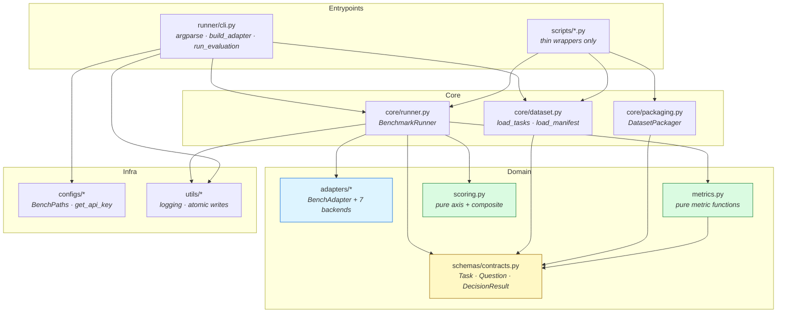
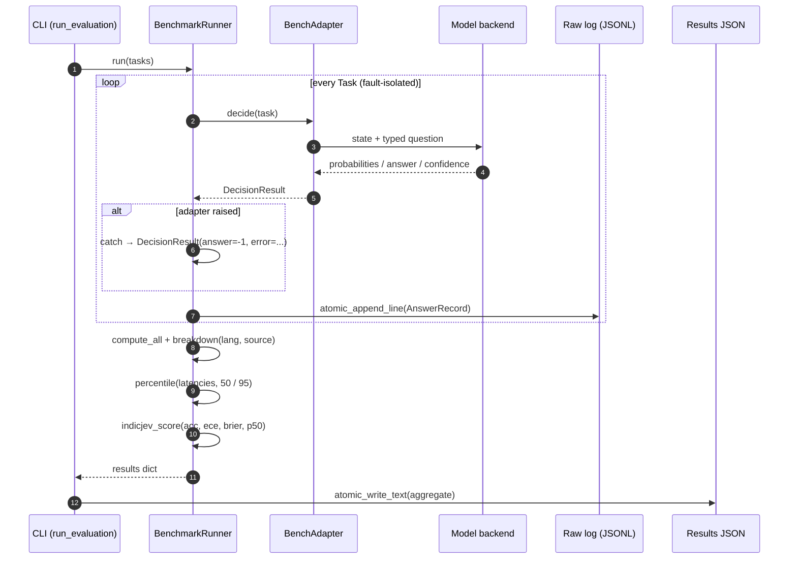

# IndicJevBench — Architecture

This document describes the package layout, data flow, extension points, and
the design decisions behind them. It reflects the code as of v1.0.0.

## Package Map

```
src/indicjevbench/
├── __init__.py           # __version__ = "1.0.0"; re-exports the public API:
│                         #   Task, Question, DecisionResult, BenchAdapter,
│                         #   BenchmarkRunner, load_tasks, compute_all,
│                         #   breakdown, indicjev_score, BenchPaths, get_api_key
├── configs/
│   ├── paths.py          # BenchPaths (frozen dataclass): bench_root,
│   │                     #   datasets_dir, results_dir; default() resolves
│   │                     #   relative to the repo/install root; dataset_files(),
│   │                     #   results_file(run_id)
│   └── env.py            # get_api_key(*names) -> str | None: first non-empty
│                         #   env var; never logs values
├── schemas/
│   └── contracts.py      # QuestionType ("choice"|"score"|"noul"), Question,
│                         #   Task (frozen; validated in __post_init__/from_dict),
│                         #   DecisionResult, AnswerRecord (raw-log line)
├── core/
│   ├── dataset.py        # load_tasks(path, max_examples=None) -> list[Task];
│                         #   load_manifest(path) -> dict
│   ├── packaging.py      # DatasetPackager — raw pipeline JSONL -> v1 files
│                         #   + manifest (used by scripts/package_datasets.py)
│   └── runner.py         # BenchmarkRunner(adapter, raw_log_path, task_name,
│                         #   logger); run(tasks) -> results dict;
│                         #   percentile(values, p) helper
├── adapters/
│   ├── base.py           # BenchAdapter ABC: decide(task) -> DecisionResult
│   ├── http.py           # HTTPAdapter — /v1/systemone client (httpx, retries)
│   ├── api_llm.py        # APILLMAdapter — OpenAI-compatible JSON mode, budget cap
│   ├── qwen3_logprob.py  # Qwen3LogprobAdapter — zero-shot option log-prob baseline
│   ├── semif.py          # SemIfAdapter — openjev semif_phase1 (lazy import)
│   ├── laya.py           # LayaAdapter — intent-only classifier (+ published mode)
│   └── local.py          # LocalAdapter — nirnaya checkpoint (lazy import)
├── metrics.py            # Pure metric functions: accuracy, macro_f1, nll, brier,
│                         #   ece (15 bins), mae_expected_level,
│                         #   automatable_share, compute_all, breakdown,
│                         #   append_to_leaderboard
├── scoring.py            # Pure axis + composite scoring: intelligence_score,
│                         #   calibration_score, speed_score, cost_score,
│                         #   indicjev_score (weights 0.35/0.25/0.20/0.20)
├── runner/
│   └── cli.py            # argparse CLI ("run" subcommand), build_adapter(args),
│                         #   run_evaluation(...), main(); entry: indicjevbench
└── utils/
    ├── logging.py        # get_logger(name), configure_logging(level) (entrypoints)
    └── atomic.py         # atomic_write_text, atomic_append_line (line-buffered)
```

`adapters/__init__.py` imports only the light abstract base — concrete
adapters are imported lazily (by the CLI's `build_adapter`) so that importing
`indicjevbench` never pulls torch/transformers/openai/semif/nirnaya.

## Module Graph

Dependency direction is one-way: entrypoints → core → adapters/schemas →
utils. Nothing below `core` imports upward.



Green = pure functions (no I/O, deterministic). Yellow = frozen contracts.
Blue = pluggable backends (heavy deps lazy).

## Data Flow

```
data/final/test.jsonl                 (upstream pipeline, outside this repo)
  → scripts/package_datasets.py
  → datasets/v1/<task_name>.jsonl     (FROZEN between releases)
  → load_tasks(path, max_examples)    (core/dataset.py: JSON parse + Task validation)
  → list[Task]
  → BenchmarkRunner.run(tasks)        (core/runner.py)
      ├─ for each Task: adapter.decide(task) → DecisionResult
      │    (per-task exceptions → DecisionResult with answer=-1, error set)
      ├─ AnswerRecord → atomic_append_line → results/v1/<run_id>_<task>_raw.jsonl
      │    (one JSON line per task, flushed immediately)
      ├─ compute_all(answers, examples) + breakdown(lang/source)  (metrics.py)
      ├─ percentile(latencies, 50/95)                              (core/runner.py)
      └─ indicjev_score(accuracy, ece, brier, p50_ms)              (scoring.py)
  → result dict:
      { n_tasks, n_answered,
        metrics: { all, choice, score, noul, by_lang, by_source },
        latency: { p50_ms, p95_ms },
        score:   { indicjev_score, axes: {intelligence, calibration, speed, cost} } }
  → runner/cli.py aggregates per-task results
  → atomic_write_text → results/v1/<run_id>.json
```

## Per-Task Sequence



Note the ordering guarantee: every decision is flushed to the raw log
*before* the next task starts, so a killed run still leaves a complete,
inspectable record of everything that finished.

## Extension Points

| Extension | Where | How |
|---|---|---|
| New model backend | `adapters/<name>.py` + `runner/cli.py::build_adapter` | Subclass `BenchAdapter`; lazy-import heavy deps; add a `--adapter` choice |
| New metric | `metrics.py` | Pure function over aligned answer/example lists; add to `compute_all` |
| New scoring axis | `scoring.py` | Pure axis function + updated `indicjev_score` weights (docs must follow) |
| New dataset file | `datasets/v1/<name>.jsonl` (+ manifest) | Same row schema; validated by `Task.from_dict`; freeze via `package_datasets.py` |
| New results sink | `metrics.py::append_to_leaderboard` or `run_evaluation` | Results dict shape is stable (see Data Flow) |

## Design Decisions

- **Pure metrics.** Everything in `metrics.py` and `scoring.py` is a pure
  function over plain lists/dicts — no I/O, no global state — so the same
  code path serves the runner, tests, and offline analysis, and outputs are
  deterministic for identical inputs.
- **Lazy heavy deps.** torch, transformers, openai, semif_phase1, and nirnaya
  are optional extras imported inside adapter constructors. `import
  indicjevbench` stays fast and never fails on a missing extra; errors name
  the extra to install.
- **Frozen contracts.** `Question` and `Task` are frozen dataclasses —
  validated once at load time (`load_tasks` raises `ValueError` with
  `file:line` context on bad rows), then immutable through the pipeline.
- **Per-task fault isolation.** `BenchmarkRunner` catches adapter exceptions
  per task and records a failed `DecisionResult` (answer=-1, error set) so one
  bad task never aborts a run; failed tasks are excluded from metrics.
- **Atomic writes.** Results JSON is written via tmp-file + rename; the raw
  log appends line-buffered JSONL so partial runs leave inspectable state.
- **Logging, not printing.** Modules log via `logging.getLogger(__name__)`;
  only the CLI entrypoint prints summary lines. Secrets are never logged —
  `get_api_key` checks only presence.
- **Frozen data.** `datasets/v1/*.jsonl` is content-frozen for
  reproducibility; the `hinglish_lid` stringified-options artifact is
  documented (docs/DATASHEET.md → Known Issues), not silently repaired.
